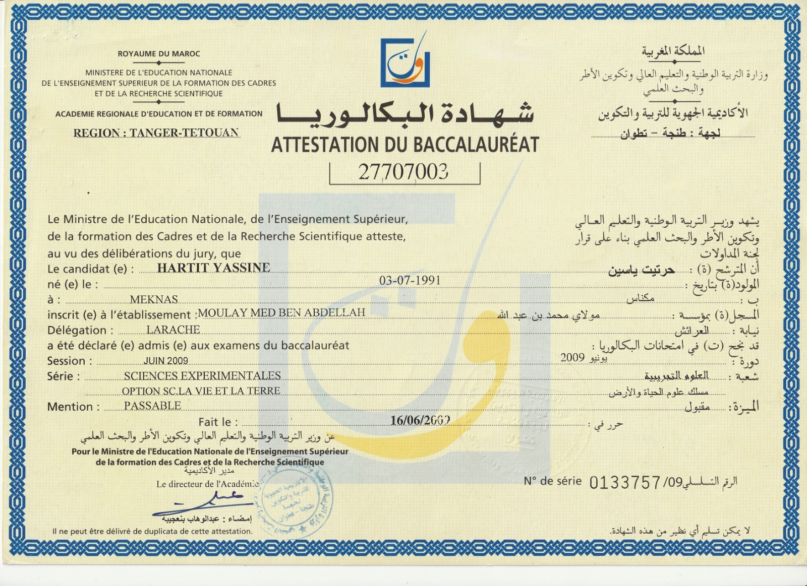
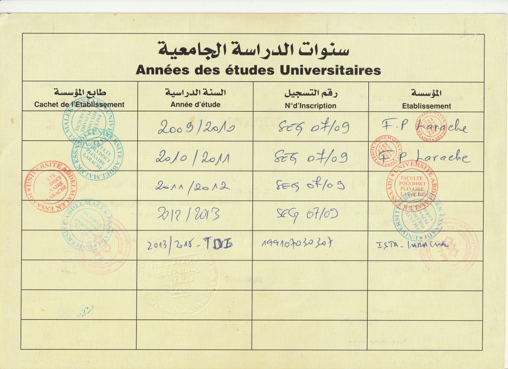
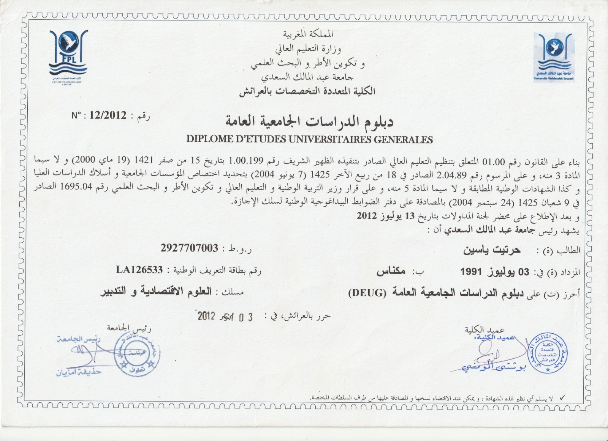
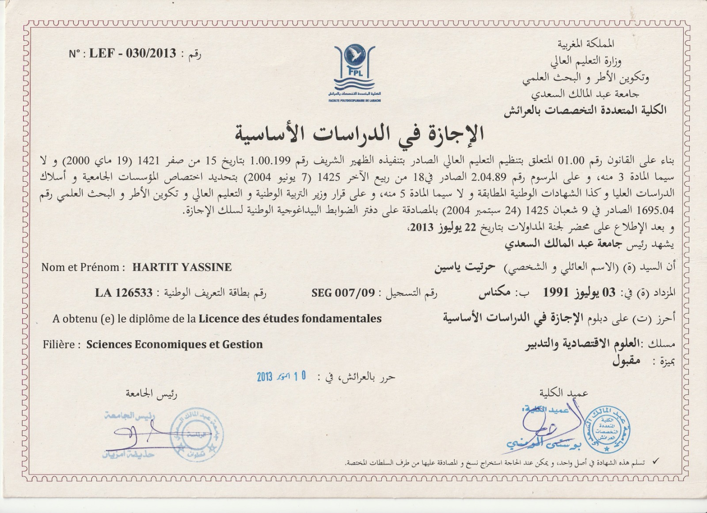
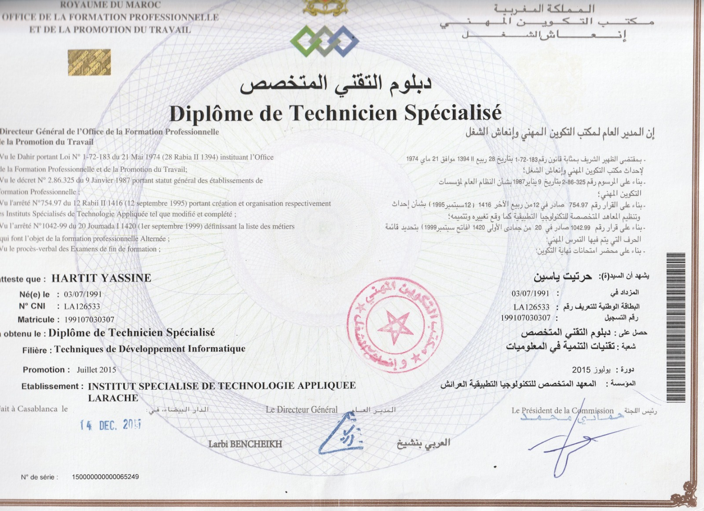
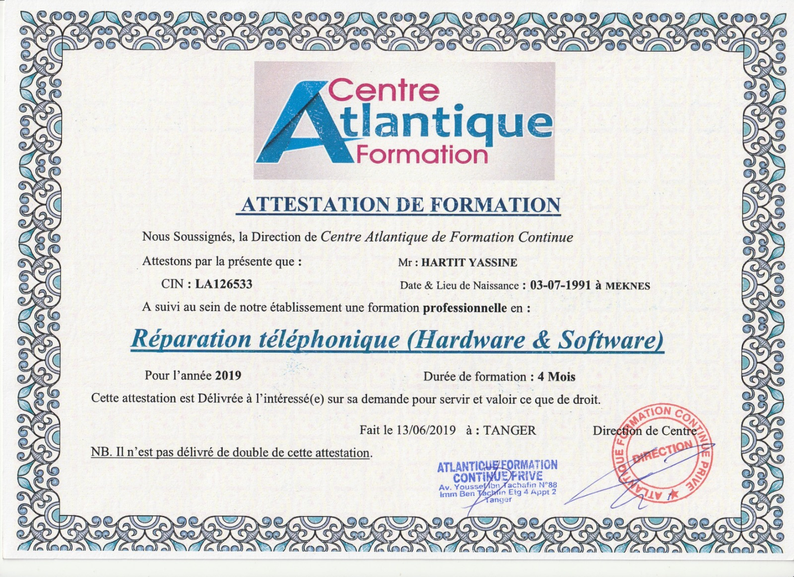
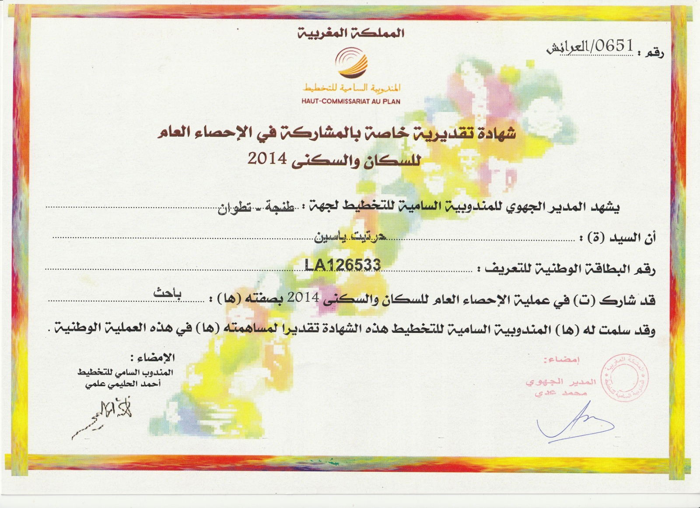

# DEVELOPPEMENT WEB

**Date of Birth:** 03/07/1991  
**Location:** Marrakech  
**Email:** hartit00@gmail.com  
**Phone:** +212775355711

## Summary
- Strong skills in web development using WordPress, PHP, HTML, JavaScript, and JQuery.
- Experience with project management and database management (MySQL).
- Familiar with statistical analysis and IT tools (MS Office, UML, Merise).

## Skills
- **Languages:** Arabic (Native), French (Fluent), English (Reading, Writing)
- **Technical Skills:** Symfony, WordPress, PHP, HTML, JavaScript, JQuery, MySQL, Project Management
- **Software:** MS Word, Excel, PowerPoint, Access

## Experience
**06/2024-Present:** Charge clientele chez wafasalaf 
**02/2024-Present:** Create site web <a href="travelxcursion.com">travelxcursion.com</a> 
**02/2024-Present:** Create site web <a href="giftsmorocco.com">giftsmorocco.com</a> 
**08/2018-Present:** Manager, Phone Accessories Store 
**17/11/2015 – 08/2018:** Mailer, Operating Media (Tanger) 
**06/04 – 16/05/2015:** Intern, RADEEL (Larache) 
**16/07 – 09/09/2011:** Intern, Marjane Holding (Marrakech) 
**01/09 – 30/09/2010:** Intern, Caisse Régionale de Crédit Agricole (Larache)  
**01/08 – 31/08/2010:** Intern, Compagnie Industrielle de LUKUS (Larache) 

## Education
- **2013-2015:** Specialist Diploma in Software Development, ISTA Larache
- **2012-2013:** Bachelor's in Economics and Management, Abdelmalek Essaadi University
- **2011-2012:** DEUG in Economics, Abdelmalek Essaadi University
- **2008-2009:** High School Diploma in Life and Earth Sciences, Moulay Mohamed Ben Abdallah High School

## Interests
- Traveling, Internet browsing, Swimming
- Driving License (Category B)

## Diplomas

<table>
  <tr>
    <th></th>
    <th></th>
    <th></th>
        <th></th>
    <th></th>
        <th></th>
    <th></th>
  </tr>
</table>

<!-- Slideshow container -->

  <!-- Full-width images with number and caption text -->
  

    
1 / 3

    
    
Caption Text

  

  

    
2 / 3

    
    
Caption Two

  

  

    
3 / 3

    
    
Caption Three

  

  <!-- Next and previous buttons -->
  <a class="prev" onclick="plusSlides(-1)">&#10094;</a>
  <a class="next" onclick="plusSlides(1)">&#10095;</a>

 

<!-- The dots/circles -->

  
  
  

