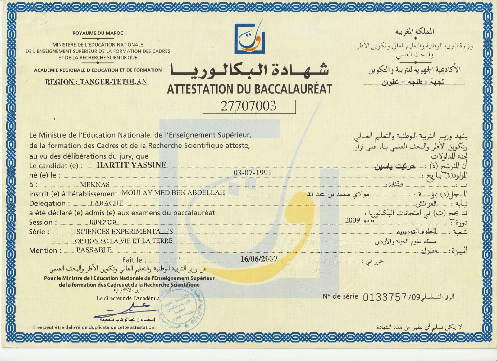
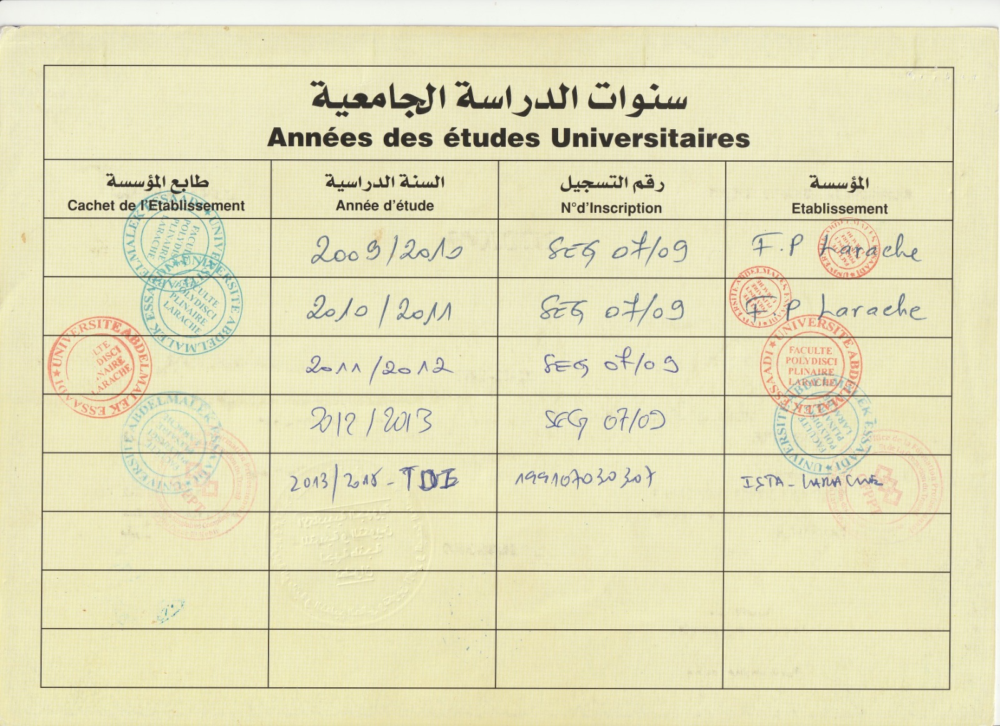
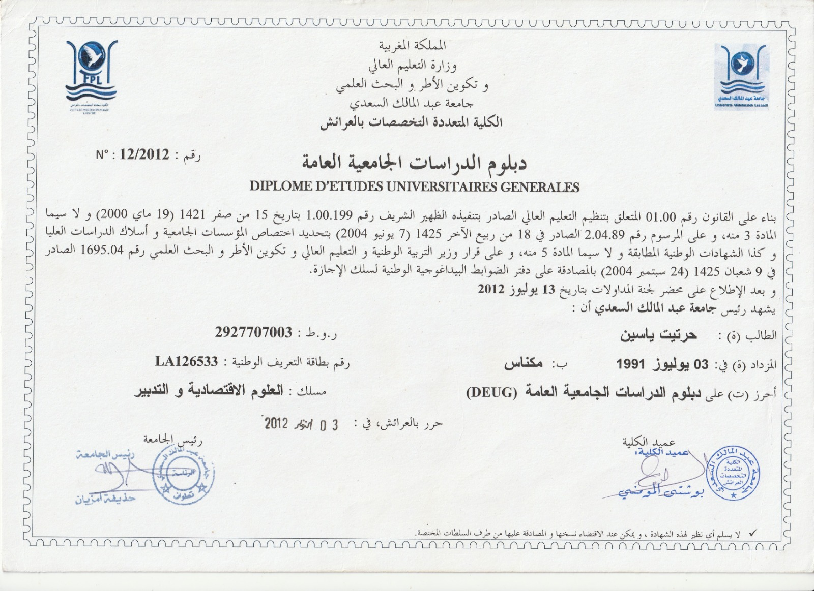
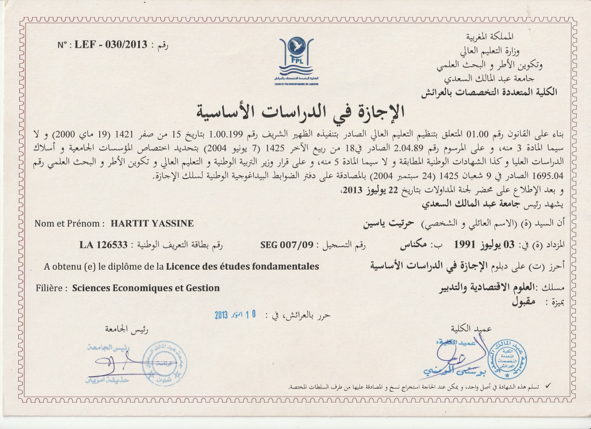
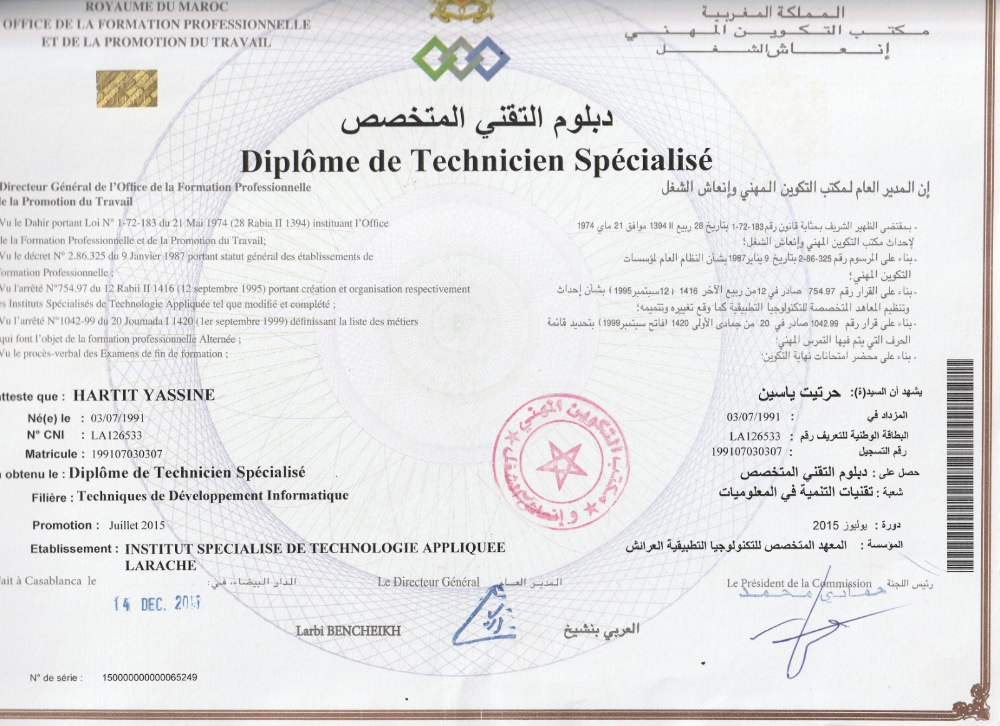
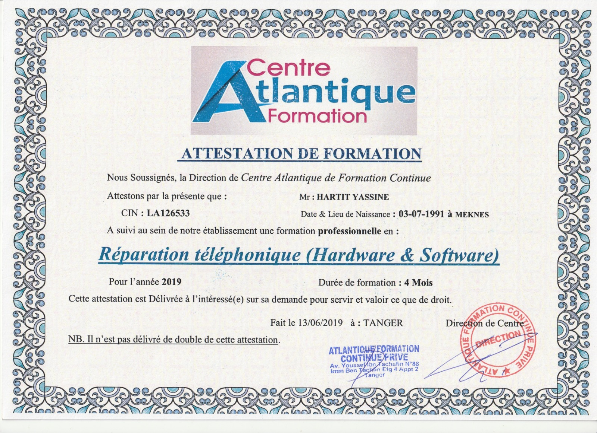
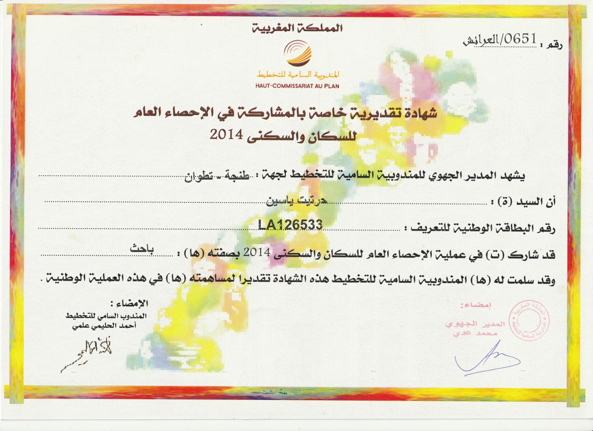

# WEB DEVELOPER

**Date of Birth:** 03/07/1991  
**Place of Birth:** Meknes  
**Email:** hartit00@gmail.com  
**Phone:** +212703819156 
**Driving License:** Category B

## Summary
-Conseiller commercial avec une double compétence en économie et informatique, je combine analyse stratégique et maîtrise des outils technologiques pour offrir des solutions adaptées aux besoins clients.

-**Relation client :** empathie, écoute active et capacité à créer un lien durable et de confiance.

-**Négociation & persuasion :** expérience dans l’adaptation du discours pour convaincre et fidéliser.

-**Outils CRM & digital :** maîtrise des solutions numériques pour optimiser la gestion de portefeuille clients.

-Diplômé en sciences économiques et gestion ainsi qu’en développement informatique, je mets à profit une vision polyvalente et orientée résultats.

🎯 **Objectif :** contribuer à la croissance commerciale d’entreprises innovantes, tout en développant des stratégies de fidélisation client et en intégrant les nouvelles technologies dans les processus de vente.

## Skills
- **Languages:** Arabic (Native), French (Fluent), English (Reading, Writing), Spanish (Reading, Writing)
- **Technical Skills:** WordPress, PHP, HTML, JavaScript, JQuery, MySQL, Project Management
- **Software:** CRM Software Management (data entry, segmentation, reporting), MS Word, Excel, PowerPoint, Access
- **Core Skills:** Customer Relationship Management (CRM), Sales Consulting & Client Advisory, Adaptability & Continuous Learning, Team                       Collaboration

## Experience
**06/2024 - Present:** Customer Service at Wafasalaf (Marrakech) 
<ul>
<li>Mission Executed:</li>
<ul>
<li>Prospecting and customer loyalty.</li>
<li>Marketing of products and services.</li>
<li>File management.</li>
<li>Providing advice to customers.</li>
<li>Negotiation.</li>
</ul>
</ul>
**02/2024 - Present:** Create Site Web travelxcursion.com 
<ul>
<li>Mission Executed:</li>
<ul>
<li>Creating and managing databases.</li>
<li>Ensuring compatibility with different browsers and devices. Working with clients and teams to understand the needs and objectives of the website.</li>
<li>Using design software to design user interfaces with writing code in HTML, CSS and JavaScript to build the user interface.</li>
</ul>
</ul>
**02/2024 - Present:** Create Site Web giftsmorocco.com 
<ul>
<li>Mission Executed:</li>
<ul>
<li>Creating and managing databases.</li>
<li>Ensuring compatibility with different browsers and devices. Working with clients and teams to understand the needs and objectives of the website.</li>
<li>Using design software to design user interfaces with writing code in HTML, CSS and JavaScript to build the user interface.</li>
</ul>
</ul>
**08/2018 - 05/2024:** Manager, Phone Accessories Store (Assilah) 
<ul>
<li>Mission Executed:</li>
<ul>
<li>Stock management and purchases and sales</li>
</ul>
</ul>
**11/2015 – 08/2018:** Mailer, Operating Media (Tanger) 
<ul>
<li>Mission Executed:</li>
<ul>
<li>Writing and communication skills with the ability to adapt the tone and style of the message according to the target audience.</li>
<li>Knowledge of email marketing tools with the ability to create and manage mailing lists.</li>
<li>Email automation skills.</li>
<li>Monitoring of campaign performance (open, click, conversion rates).</li>
</ul>
</ul>
**06/04 – 16/05/2015:** Intern, RADEEL (Larache) 
**16/07 – 09/09/2011:** Intern, Marjane Holding (Marrakech) 
**01/09 – 30/09/2010:** Intern, Caisse Régionale de Crédit Agricole (Larache)  
**01/08 – 31/08/2010:** Intern, Compagnie Industrielle de LUKUS (Larache) 

## Education
- **2013-2015:** Specialist Diploma in Software Development, ISTA Larache
- **2012-2013:** Bachelor's in Economics and Management, Abdelmalek Essaadi University
- **2011-2012:** DEUG in Economics, Abdelmalek Essaadi University
- **2008-2009:** High School Diploma in Life and Earth Sciences, Moulay Mohamed Ben Abdallah High School

## Interests
- Traveling,
- Internet browsing
- Swimming

## Diplomas

